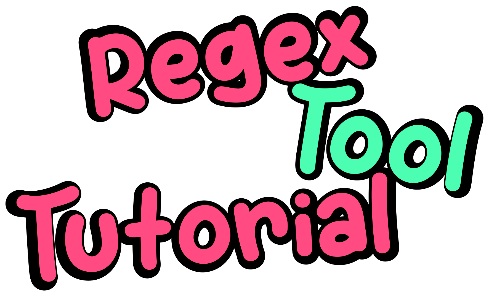
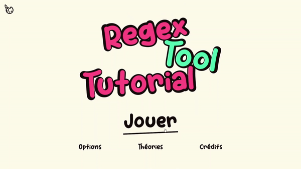
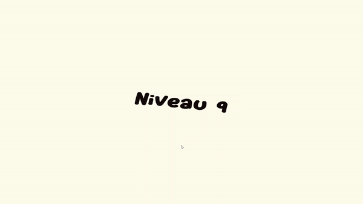
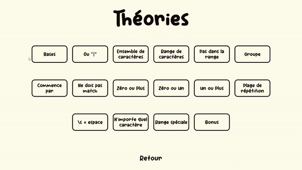
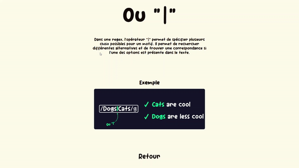
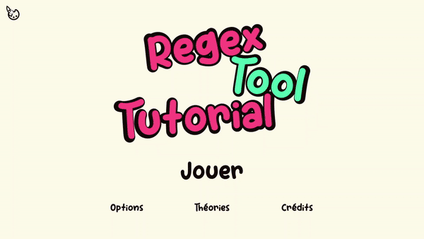
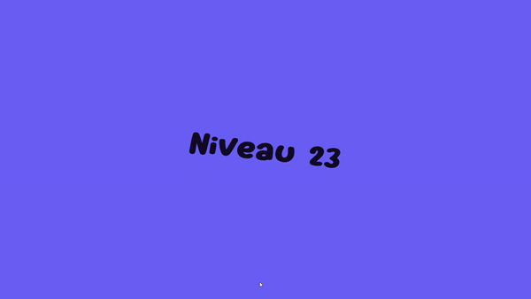

<p align="center">
    
    <h1 align="center" style="margin:0">
        Regex Tool Tutorial
    </h1>
    <h4 align="center" style="margin:0">
        TPI par Theo Bensaci - MID 4
    </h4>
    <h5 align="center" style="margin:0;margin-top:20px;">
        89H
    </h5>
    <h5 align="center" style="margin:5px">
        CFPV (COFOP-ETML), Avenue de Valmont 28b, 1010 Lausanne
    </h5>
    <h5 align="center" style="margin:5px">
        Supervisé par – Aurélie Curchod
    <h5 align="center" style="margin:5px">
        Expertisé par – Nicolas Borboën et Süleyman Ceran
    </h5>
</p>

## À propos
<p>
    <p style="margin:15px">
    « Regex Tool Tutorial » est un jeu qui a pour but de rendre ludique l’apprentissage des regex. 
    </p>
    <p align="center">
        
    </p>
    <p style="margin-top:10px">
        Chaque niveau présente des chaînes de caractères. Le joueur doit créer une expression régulière (regex) qui permet de valider une partie de ces chaînes et d'invalider les autres. Ainsi, le joueur devra utiliser ses connaissances en regex afin de venir à bout de tous les niveaux proposés par le jeu.
    </p>
    <p align="center">
        
    </p>
    </p>
        Pour l'aider, le jeu propose des petits tutoriels qui permettent d'expliquer et de vulgariser les aspects de base de la création de regex.
    </p>
    <p align="center">
        
    </p>
    <p align="center">
        
    </p>
    <p style="margin:15px">
        Pour rajouter des objectifs au joueur, le jeu propose également des palettes de couleurs à débloquer afin de personnaliser l'apparence du jeu à sa guise.
    </p>
    <p align="center">
        
    </p>
    <p align="center">
        
    </p>
</p>

## Comment y jouer
Il y a deux manières d'y accéder.
- Grâce à mon [itch.io](https://me-theo.itch.io "itch.io") où le projet est déployé, voici le lien : [Cliquer ici](https://me-theo.itch.io/regextooltutorial?secret=Vn2GsRff9eEZzBrn7Y5H3Kd4lY "Cliquer ici").
- Ou alors, en le déployant de votre côté. Vous pouvez télécharger une version build du site dans les **releases**. Cette version est un site classique. À partir de là, libre à vous de l'héberger comme bon vous semble.

## Comment l'installer
Alors, tout d'abord, il vous faut **NPM**. Vous pouvez l'installer en vous rendant à ce [lien](https://docs.npmjs.com/downloading-and-installing-node-js-and-npm "Downloading and installing Node.js and npm").

Lorsque **NPM** est installé, vous devez ensuite installer **Node.js (v14.15.4)**. Pour cela, utilisez la commande suivante :
```
npm install -g node@14.15.4
```

Ensuite, téléchargez le dépôt Git en utilisant la commande suivante :
```
git clone https://github.com/Me-Theo/regex_tool_tutorial
cd regex_tool_tutorial
```

Maintenant, installez les packages de l'application en utilisant la commande suivante : 
```
npm install
```

Pour vérifier si tout a bien été installé, lancez le projet en utilisant la commande suivante :
```
npm start
```

Si vous souhaitez builder le projet, utilisez la commande suivante :
```
npm run-script build
```


## Ajout de contenu
### Création de level
Pour ajouter un niveau, il suffit d'ajouter une entrée dans le fichier **level.json** qui se trouve dans le dossier **/src/ressources/data/**. Une entrée ressemble par exemple à ceci :

```JSON
{
    "startTheorie":true,
    "theorieIndex":0,
    "name":"",
    "words":[
        {
            "text":"Hello",
            "targetState":true
        },
        {
            "text":"World",
            "targetState":false
        }
    ],
    "placeHolder":"",
    "limit":-1
},
```
Voici de quoi il est composé :
+ **startTheorie** => Si le niveau commence par une théorie ou non
+ **thorieIndex** => Index de la théorie qui est reliée au niveau, si pas de théorie = -1
+ **name** => Nom du niveau, s'il est laissé vide, c'est le nom de la théorie qui sera utilisé.
+ **words** => Chaîne de caractères à valider ou non, avec comme valeur
    + **text** => Texte de la chaîne
    + **targetState** => Si elle doit être validée ou non pour finir le niveau
+ **placeHolder** => Regex mise par défaut
+ **limit** => Nombre de caractères maximum que peut avoir la regex

## Création de théories
Pour ajouter une théorie, il suffit d'ajouter une entrée dans le fichier **theorie.json** qui se trouve dans le dossier **/src/ressources/data/**. Une entrée ressemble par exemple à ceci :
```JSON
{
    "name":"Bases",
    "text":"Une regex est un motif de recherche qui permet de chercher des correspondances dans du texte.",
    "imagLink":"Basic.png"
},
```
Voici de quoi il est composé :
+ **name** => Nom de la théorie
+ **text** => Texte de la théorie
+ **imagLink** => Nom de l'image d'illustration de la théorie, l'image doit se trouver dans le dossier **/src/image/TotuImag/**

## Création de pallette
Pour ajouter une palette de couleurs, il suffit d'ajouter une entrée dans le fichier **palette.json** qui se trouve dans le dossier **/src/ressources/data/**. Une entrée ressemble par exemple à ceci :
```JSON
{
    "name":"Celeste",
    "main":"#3E2A60",
    "background":"#8CCCE4",
    "valide":"#40FF61",
    "invalide":"#FD246D",
    "progressionUnlock":16
},
```
Voici de quoi il est composé :
+ **name** => Nom de la palette
+ **main** => Couleur principale de la palette (en hexadécimal)
+ **background** => Couleur de fond de la palette (en hexadécimal)
+ **valide** => Couleur des mots validés de la palette (en hexadécimal)
+ **invalide** => Couleur des mots invalidés de la palette (en hexadécimal)
+ **invalide** => Quel niveau de progression le joueur doit atteindre pour débloquer la palette


